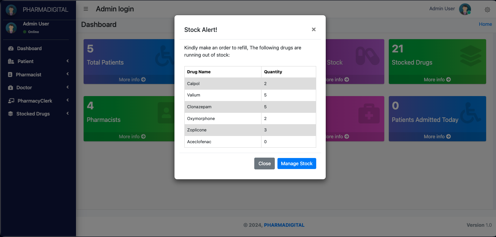
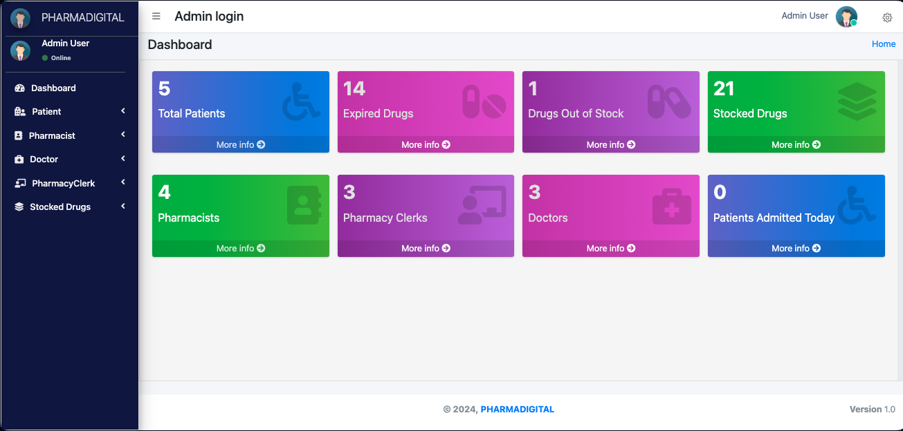

# PharmacyManagementSystem

<h2>🔥Pharmacy Dispensing Management System || Python Django</h2>
  
  
   
This is a simple Pharmacy Management System programmed using Python Django. The system has 5 types of users are the Administrator, Pharmacist, Doctor, and Receptionist(pharmacyClerk) and Patient.This project has user-friendly functionalities.

<table>
  <tr>
    <td></td>
    <td></td>
  </tr>
</table>

## Run these Commands

### Step 1

     pip install -r requirements.txt

### Step 2

     python manage.py migrate

### Step 3

     python manage.py runserver

---

### Admin User Login:

- Username: admin
- password: 1234

          Administrator Main Features

  - Manage Admissions/Patients
  - Manage System Users
  - Manage Patient's Prescription
  - Manage Medicinal Drugs Categories
  - Manage Medicinal Drugs
  - Manage Stocks
  - Dispense Medicinal Drug
  - Manage Personal Account

---

### Patient Login:

- Username: patient1
- password: 1234

           Patient Main Features

  - Manage his/her medications
  - Feedback Pharmacist incase of dispensing issue
  - manage Personal Account

---

### Pharmacist Login:

- Username: pharmacist1
- password: 1234

        Pharmacist  Main Features

  - Manage Medicinal Drugs
  - Manage Stocks
  - Dispense Medicinal Drug
  - Manage Patient Feedback messages
  - Manage Personal Account

---

### PharmacyClerk Login:

- Username: pharmacyclerk1
- password: 1234

            Receptionist Main Features

  - Manage Admissions/Patients
  - Manage Personal Account

---

### Doctor Login:

- Username: doctor1
- password: 1234
  Doctor Main Features
  - Manage Patient's Prescription
  - Manage Personal Account
